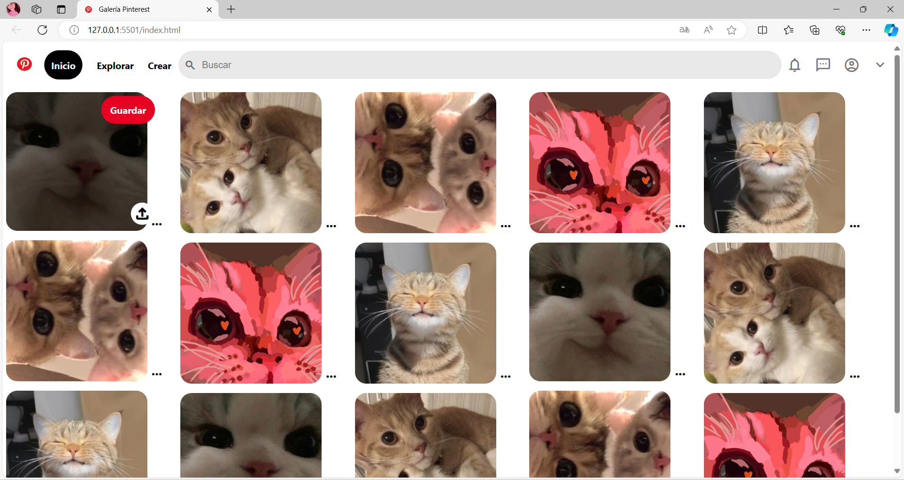

# Clon de Pinterest con HTML y CSS
Este proyecto es un clon de la ***interfaz de usuario de Pinterest***, creado puramente con *HTML5* y *CSS3*. 

Se efoca en replicar la apariencia visual de Pinterest, ofreciendo una experiencia de navegación similar con un diseño responsivo y funcionalidades básicas.

## Características

* **Diseño responsivo:** adaptable a diferentes tamaños de pantalla para una **experiencia de usuario** óptima en dispositivos móviles :iphone: y de escritorio :computer:.
* **Interfaz de usuario intuitiva:** Inspirada en Pinterest, con una navegación fácil y accesible.
* Iconografía y estilos modernos: Uso de la biblioteca de íconos de material design y estilos css modernos 🖍️.

### Tecnologías usadas
 + **HTML 5** Para la estructura básica del sitio.
 + **CSS3** Para el diseño y el estilo, inclut¿yendo _flexbox_ para un diseño respponsivo y efectos de _hover_.
 + **Google Fonts:** Para fuentes personalizadas.

###**Vista previa del proyecto***

### Contacto
Si te gustaría invitarme a colaborar en un proyecto; escríbeme por [Instagram](https://www.instagram.com/cep_0131/).
   
